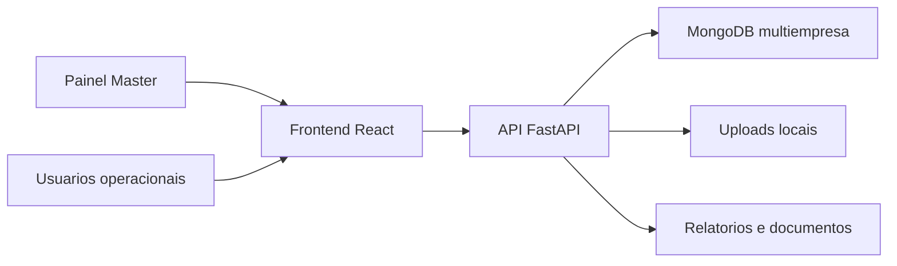

# GestorEPI Multiempresas V5.9

Sistema web multiempresa para gestao de EPIs, colaboradores, estoque, entregas, kits por setor, alertas operacionais, LGPD e administracao centralizada.

> Status: em revisao para organizacao profissional e saneamento de dados sensiveis.

## Visao Geral

O GestorEPI Multiempresas permite controlar operacoes de EPI em mais de uma empresa, separando cadastros, usuarios, colaboradores, EPIs, fornecedores e entregas por contexto empresarial.

## Funcionalidades

- Painel master para gestao de empresas.
- Autenticacao com perfis de acesso.
- Cadastro de colaboradores e empresas.
- Controle de EPIs, estoque, fornecedores e ferramentas.
- Entrega, devolucao e historico de EPIs.
- Kits obrigatorios por setor.
- Alertas e relatorios operacionais.
- Modulo LGPD.
- Suporte a evidencias e autenticacao de fichas.

## Tecnologias

- Python
- FastAPI
- MongoDB
- React
- Tailwind CSS
- Radix UI
- ReportLab
- OpenPyXL

## Arquitetura

## Configuracao

Use `.env.example` como base e defina segredos reais somente no ambiente seguro.

Nunca versione `.env`, backups, bancos de dados, hashes de senha, fotos reais, CPFs, dados biometricos ou informacoes internas de clientes.

## Seguranca

Esta branch remove backups e uploads versionados do conteudo atual e reforca o `.gitignore`. A remocao nao limpa historico Git antigo.

Veja [SECURITY.md](SECURITY.md) e [docs/security-audit.md](docs/security-audit.md).

## Licenca

Projeto proprietario. Todos os direitos reservados.

