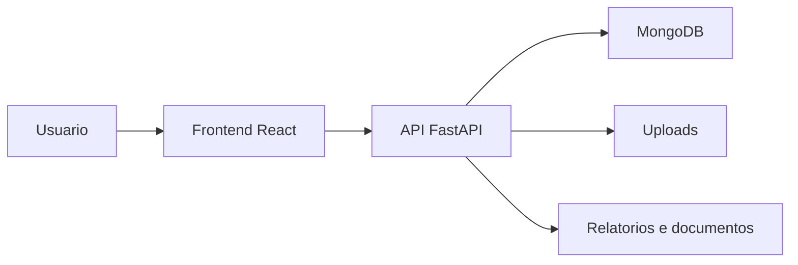

# GestorEPI Multiempresas V5.9

Sistema web multiempresa para gestao de EPIs, colaboradores, empresas, fornecedores, estoque, kits, entregas, historico, alertas e relatorios.

## Visao Geral

O projeto centraliza rotinas de seguranca do trabalho relacionadas a EPIs em uma plataforma com separacao por empresas. A aplicacao possui frontend em React, API em FastAPI e persistencia em MongoDB.

## Problema Resolvido

O sistema atende operacoes que precisam controlar entregas de EPI, manter historico por colaborador, organizar estoque e consultar informacoes por empresa, reduzindo dependencia de planilhas e registros manuais.

## Principais Funcionalidades

### Funcionalidades Disponiveis

- Autenticacao e perfis de usuario.
- Painel master multiempresa.
- Cadastro de empresas.
- Cadastro de colaboradores.
- Cadastro de EPIs e fornecedores.
- Gestao de estoque.
- Kits de EPI.
- Registro de entregas.
- Historico de entregas.
- Relatorios e dashboards.
- Recursos de documentacao, LGPD e alertas identificados na interface.

### Funcionalidades Em Desenvolvimento

- Melhorias de alertas, kits e rastreabilidade aparecem em telas, testes e documentos do repositorio.

### Funcionalidades Planejadas

- Informacao nao confirmada no conteudo atual do repositorio.

## Como Funciona

```text
Usuario acessa o sistema
-> realiza autenticacao
-> seleciona empresa ou modulo operacional
-> cadastra colaboradores, EPIs, fornecedores e kits
-> registra entregas e acompanha estoque
-> a API processa e consulta os dados
-> MongoDB armazena as informacoes
-> dashboards e relatorios apresentam o resultado
```

## Tecnologias Utilizadas

- Python
- FastAPI
- MongoDB
- React
- Tailwind CSS
- face-api.js
- html5-qrcode
- ReportLab
- OpenPyXL

## Arquitetura



## Estrutura Do Projeto

- `backend/`: API, autenticacao, banco de dados, schemas, seeds, uploads e testes.
- `frontend/`: interface web, componentes, paginas e contexto de autenticacao.
- `demo_screenshots/`: materiais demonstrativos existentes no repositorio.
- `memory/`: artefatos de acompanhamento existentes nesta versao.

## Status

Versao multiempresa mais recente identificada na familia GestaoEPI. Deve ser comparada com `GestaoEPI-V5.1.0-NOVO-01` antes de definir qual sera promovida como principal no portfolio.

## Autor

Desenvolvido por Michele Santana — Kalion Tecnologia

Perfil profissional: https://github.com/Tr3mbolon4
