# Sistema GestãoEPI Multi-Empresas - Guia de Demonstração

## Sobre o Sistema

O **GestãoEPI** é um sistema completo para gerenciamento de Equipamentos de Proteção Individual (EPIs) com suporte a múltiplas empresas. O sistema oferece:

- **Gestão Multi-Empresa**: Cada empresa tem seus próprios dados isolados
- **Reconhecimento Facial**: Entrega de EPIs com verificação biométrica
- **Conformidade LGPD**: Controle de consentimento para dados biométricos
- **Relatórios Avançados**: PDF e Excel com análises completas
- **Controle de Estoque**: Alertas de vencimento e estoque baixo

---

## Telas do Sistema

### 1. Tela de Login
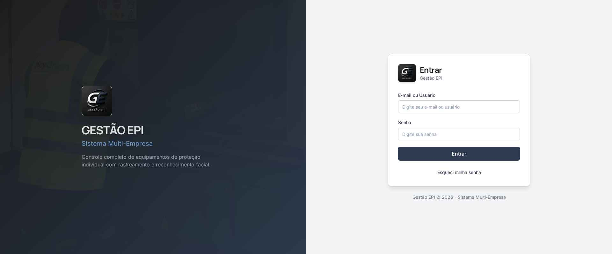

**Funcionalidades:**
- Login com e-mail ou nome de usuário
- Recuperação de senha
- Design moderno e responsivo

---

### 2. Dashboard Principal
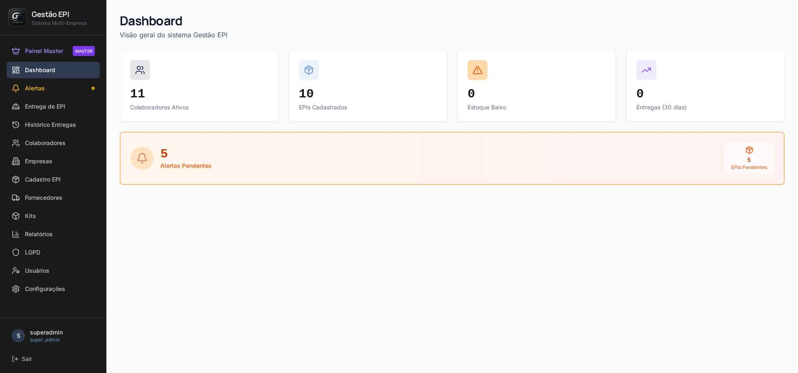

**Indicadores:**
- Colaboradores ativos
- EPIs cadastrados
- Alertas de estoque baixo
- Entregas nos últimos 30 dias
- EPIs pendentes de entrega

---

### 3. Painel Master (Super Admin)
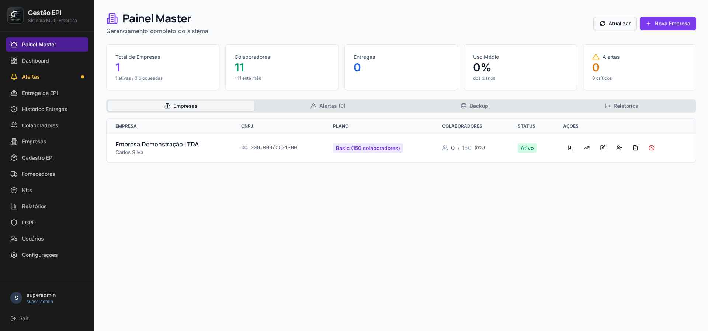

**Funcionalidades:**
- Visão geral de todas as empresas
- Controle de licenças e planos
- Estatísticas por empresa
- Gestão de backups
- Bloqueio/desbloqueio de empresas

---

### 4. Gestão de Colaboradores
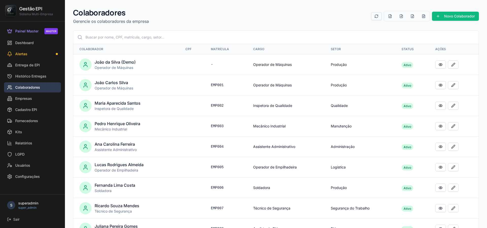

**Funcionalidades:**
- Cadastro completo com foto
- Importação/exportação Excel
- Busca por nome, CPF, matrícula
- Filtro por empresa e setor
- Status ativo/inativo

---

### 5. Cadastro de EPIs
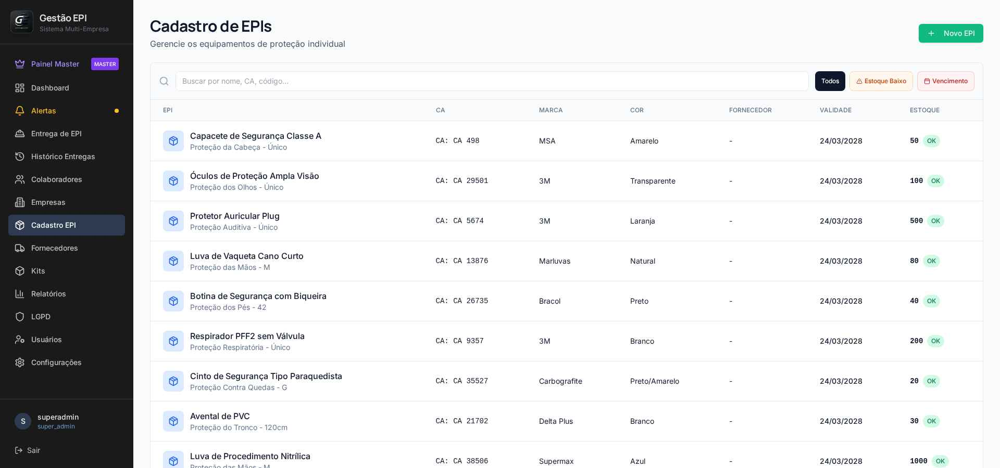

**Funcionalidades:**
- Cadastro com CA (Certificado de Aprovação)
- Controle de estoque e validade
- Vinculação com fornecedores
- Filtros: estoque baixo, vencimento
- Código de barras/QR Code

---

### 6. Kits de EPIs
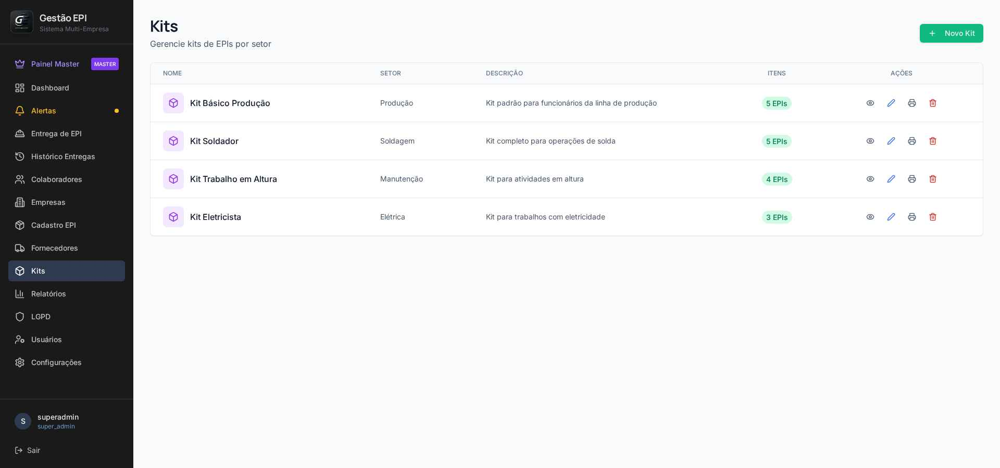

**Funcionalidades:**
- Agrupamento de EPIs por função
- Entrega rápida de kits completos
- Impressão de etiquetas
- Personalização por setor

---

### 7. Entrega de EPI com Reconhecimento Facial
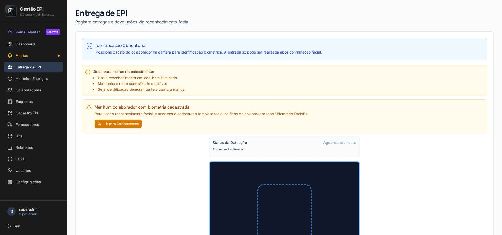

**Funcionalidades:**
- Identificação biométrica do colaborador
- Confirmação automática de identidade
- Registro de data/hora e responsável
- Baixa automática no estoque
- Suporte a devolução

---

### 8. Histórico de Entregas
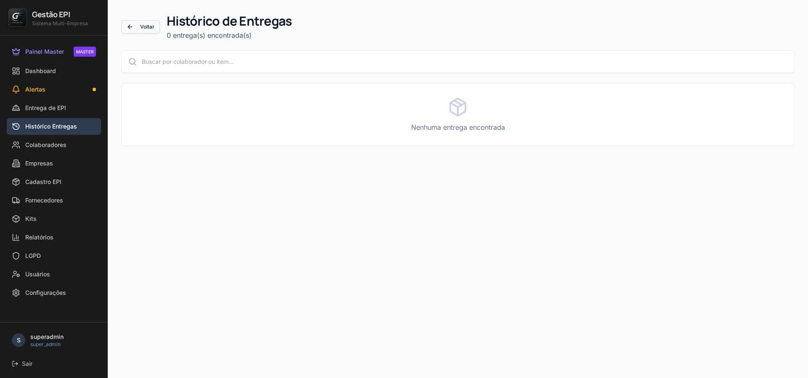

**Funcionalidades:**
- Registro completo de movimentações
- Filtro por período e colaborador
- Exportação para PDF/Excel
- Rastreabilidade total

---

### 9. Fornecedores
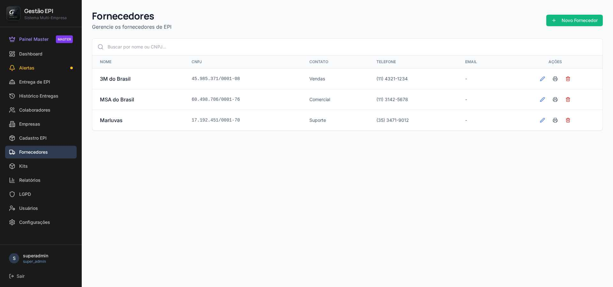

**Funcionalidades:**
- Cadastro de fornecedores de EPI
- Dados de contato e CNPJ
- Impressão de relatório

---

### 10. Relatórios Avançados
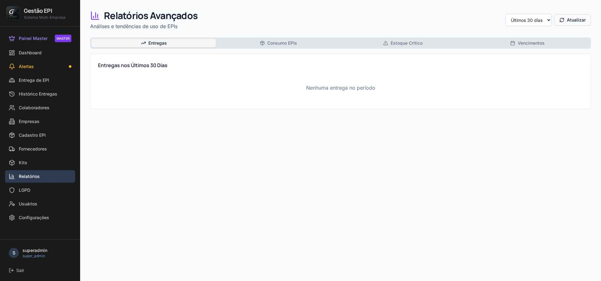

**Funcionalidades:**
- Entregas por período
- Consumo de EPIs
- Estoque crítico
- Vencimentos próximos
- Exportação PDF/Excel

---

### 11. Conformidade LGPD
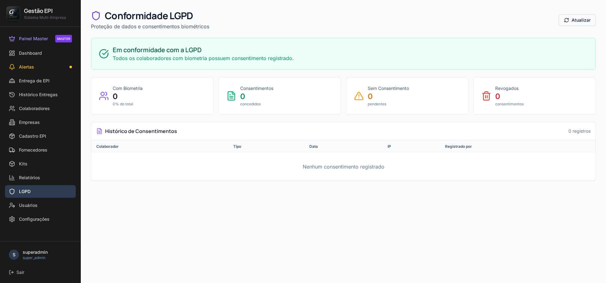

**Funcionalidades:**
- Controle de consentimentos biométricos
- Histórico de autorizações
- Indicadores de conformidade
- Registro de IP e data

---

### 12. Gestão de Usuários
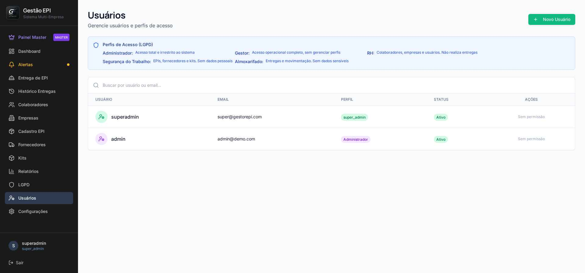

**Perfis de Acesso:**
- **Administrador**: Acesso total ao sistema
- **Gestor**: Operações completas sem gerenciar perfis
- **RH**: Colaboradores, empresas e usuários
- **Segurança do Trabalho**: EPIs, fornecedores e kits
- **Almoxarifado**: Entregas e movimentações

---

### 13. Central de Alertas
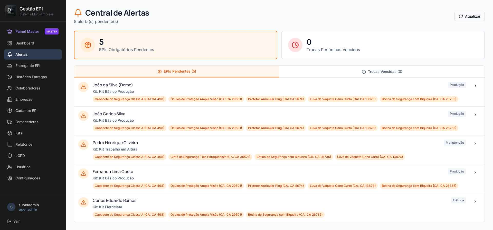

**Tipos de Alertas:**
- EPIs obrigatórios pendentes
- Trocas periódicas vencidas
- Estoque crítico
- CA próximo do vencimento

---

## Credenciais de Demonstração

### Super Admin (Painel Master)
- **Usuário:** superadmin
- **Senha:** Super@2026!

### Admin Empresa
- **Usuário:** admin
- **Senha:** Admin@2026!

---

## Tecnologias Utilizadas

- **Frontend:** React 19 + Tailwind CSS + Radix UI
- **Backend:** FastAPI (Python)
- **Banco de Dados:** MongoDB
- **Reconhecimento Facial:** face-api.js
- **Relatórios:** ReportLab (PDF) + OpenPyXL (Excel)

---

## Contato

Para mais informações sobre o sistema GestãoEPI, entre em contato.
